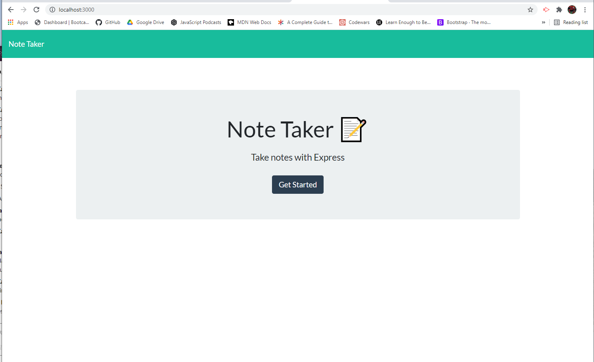

# noteTaker

## Table of Contents
- [Overview](#overview)
- [Installation](#installation)
- [Screenshot](#screenshot)
- [Deployed Link](#deployed-link)
- [Questions](#questions)

## Overview
Your assignment is to modify starter code to create an application called Note Taker that can be used to write and save notes. This application will use an Express.js back end and will save and retrieve note data from a JSON file.

The application’s front end has already been created. It's your job to build the back end, connect the two, and then deploy the entire application to Heroku.

## Installation
npm i

## Screenshot

## Deployed Link
[noteTaker](https://note-takerjjk.herokuapp.com/)

### Questions
If you have any questions, please refer to my Github page, [JamieKaczor](https://github.com/JamieKaczor), or contact me through my email, Dignanjk@aol.com